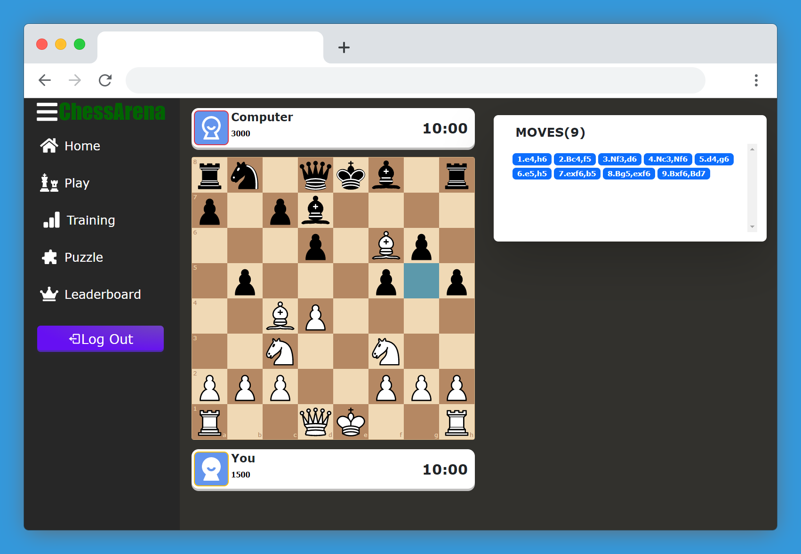

<a name="readme-top"></a>

[](https://github.com/IndieCoderMM/chess-arena/commits/)
[](https://github.com/IndieCoderMM/chess-arena/stargazers)


## 📑 Table of Contents
- [♟ Chess Arena](#-chess-arena)
  - [🔥 Key Features](#-key-features)
  - [👨‍💻 Built With](#-built-with)
    - [🧰 Tech Stack](#-tech-stack)
    - [⚙ Implementation](#-implementation)
  - [🚀 Live Demo](#-live-demo)
  - [🎯 Todos](#-todos)
  - [💻 Getting Started](#-getting-started)
    - [Prerequisites](#prerequisites)
    - [Setup](#setup)
    - [Install](#install)
    - [Usage](#usage)
    - [Deployment](#deployment)
  - [📧 Contact](#-contact)
  - [🤝 Contributing](#-contributing)
  - [💖 Show your support](#-show-your-support)
  - [💎 Useful Resources](#-useful-resources)
  - [📝 License](#-license)


# ♟ Chess Arena

**👷‍♂️Still under development**

A chess website that allows users to play chess online with other players, solve puzzles and view leaderboard.



<p align="right">(<a href="#readme-top">back to top</a>)</p>

## 🔥 Key Features

- Play chess with a computer opponent 
- Solve daily chess puzzles 
- View top players

<p align="right">(<a href="#readme-top">back to top</a>)</p>

## 👨‍💻 Built With

### 🧰 Tech Stack
- React
- Redux
- Bootstrap
- Firebase

<p align="right">(<a href="#readme-top">back to top</a>)</p>

### ⚙ Implementation
- Chessboard created with *react-chessboard*
- Move validation using *chess.js*
- Access puzzles and leaderboards through Chess.com API
- User authentication provided by *Firebase*

<p align="right">(<a href="#readme-top">back to top</a>)</p>

## 🚀 Live Demo

You can visit the [MVP version of this website here](https://chess-arena.onrender.com).

<p align="right">(<a href="#readme-top">back to top</a>)</p>


## 🎯 Todos

- [ ] Match history
- [ ] Puzzle leaderboard
- [ ] Two-player mode
- [ ] Time control
- [ ] Profile data


<p align="right">(<a href="#readme-top">back to top</a>)</p>


## 💻 Getting Started

To get a local copy up and running, follow these steps.

### Prerequisites

In order to run this project you need [Node.js](https://nodejs.org/en/) installed on your machine.

### Setup

Clone this repository to your desired folder:

```sh
  cd my-project
  git clone git@github.com:IndieCoderMM/chess-arena.git .
```

### Install

Install the dependencies with:

```sh
  npm install
```

### Usage

To run the project, execute the following command:

```sh
  npm start
```

### Deployment

You can deploy this project using:

```sh
  npm run build
```
This will create a production-ready build of your website in `build/` folder, which you can use to deploy on a static site hosting platform.

<p align="right">(<a href="#readme-top">back to top</a>)</p>

## 📧 Contact 

I am always looking for ways to improve my project. If you have any suggestions or ideas, I would love to hear from you.

[](https://github.com/IndieCoderMM)
[](https://linkedin.com/in/hthantoo)
[](mailto:hthant00chk@gmail.com)

<p align="right">(<a href="#readme-top">back to top</a>)</p>


## 🤝 Contributing 

I welcome any and all contributions to my website! If you have an idea for a new feature or have found a bug, please open an issue or submit a pull request.

Feel free to check the [issues page](../../issues/).

<p align="right">(<a href="#readme-top">back to top</a>)</p>


## 💖 Show your support 

If you like this project, please consider giving it a ⭐.

<p align="right">(<a href="#readme-top">back to top</a>)</p>

## 💎 Useful Resources
 -

<p align="right">(<a href="#readme-top">back to top</a>)</p>


## 📝 License

This project is [MIT](./LICENSE) licensed.

<p align="right">(<a href="#readme-top">back to top</a>)</p>